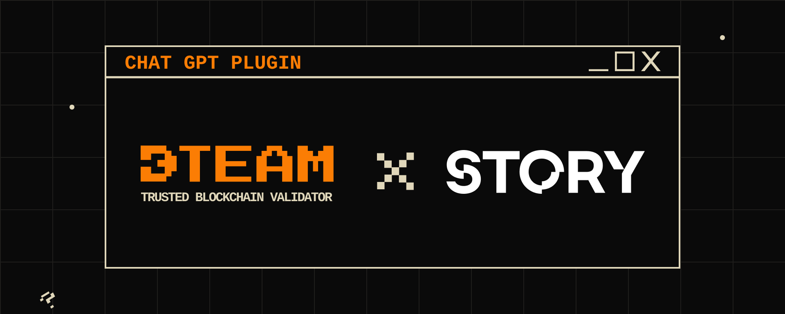

# Chat GPT assistant for Story Protocol

Story Protocol AI Assistance ChatGPT Plugin — an AI-powered assistant that helps users interact with and understand the Story blockchain protocol. This plugin is designed to support node runners, developers, and users by providing detailed answers and step-by-step instructions based on the Story protocol knowledge base.

### Link: https://chatgpt.com/g/g-673b6f19371481919fe8b41d62d0d83d-story-protocol-assistant-by-dteam

### Key Features

- **Interactive Node Setup Guidance**: 
   The plugin offers real-time, step-by-step instructions for setting up a Story blockchain node. Whether it's installing dependencies, managing snapshots, or adjusting configurations, the AI assists users in performing these tasks efficiently.

-  **Real-Time Q&A on Story Protocol**: 
   Users can ask various questions about the Story blockchain protocol, including technical specifications, consensus details, governance, and more. The plugin provides answers based on the latest official documentation, ensuring accuracy and relevance.

### Use the Plugin example 

1. **Ask for General Protocol Information**:
   - Example: `"Give me step by step guide how to setup node?"`
   - The AI will give you a step-by-step guide, including commands to install dependencies, configure settings, and start your node.

