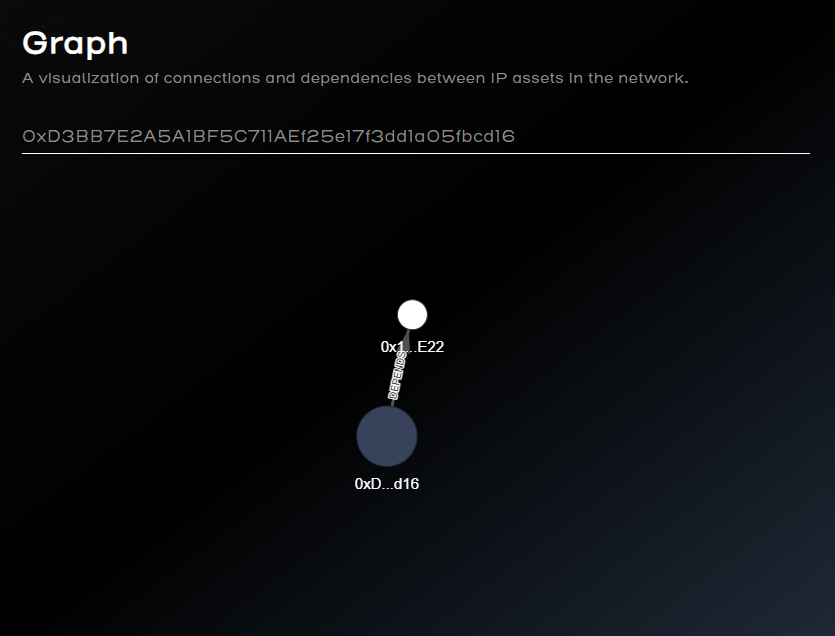

# Story IP Graph Visualization | IP Graph Explorer

> **Note**: As this application is in early access, the dataset is limited. Stay tuned for updates as more features and data will be added in the coming releases!

**This tool is designed to help users explore and understand the connections between different IP assets, providing a clear and interactive way to navigate the web of IP ownership.**

**Story IP Graph Visualization (IP Graph Explorer)** is the first IP explorer in the [Story Protocol](https://www.story.foundation/) ecosystem. It is currently in early access (demo mode) and processes only a small portion of data, which will be expanded over time.

## Our Vision

We aim to make IP ownership and rights management more transparent. Our goal is to provide a user-friendly interface for navigating the Story Protocol ecosystem, visualizing the relationships between IP assets, and simplifying the process of managing them.

## Key Features

- **Interactive Graph**  
  A dynamic visualization showing connections and dependencies between IP assets.  
- **Search by Asset ID**  
  Quickly locate a specific IP asset and see its related connections in a centralized graph.  
- **Real-Time Metadata**  
  Display essential asset information, including address, contract, and current status.   
- **Scalable Architecture**  
  More data and features (such as IP registration and enhanced metadata) are planned for future releases.

## Usage Examples

1. **IP Network Exploration**  
   Enter a valid `asset ID` to generate a graph showing the asset at the center and all connected IP assets branching out.  
2. **Detailed Asset Information**  
   Click on any node to display the asset’s core properties: name, address, contract, registration date, and more.  
3. **Upcoming Enhancements**  
   Future updates will include wallet integration for registering new IP assets and the ability to modify existing records.

## Screenshots

Below are a few screenshots from the demo version:

1. **Main Screen with Graph**  
   Displays the network of IP assets in a circular/graph layout, along with stats such as total registered IPs.

   

2. **Asset Information Page**  
   Shows specific details for each asset, including ID, name, contract address, and token URI.

   

3. **"DEPENDS" Relationship Example**  
   Illustrates how one asset may depend on another within the network.

   
